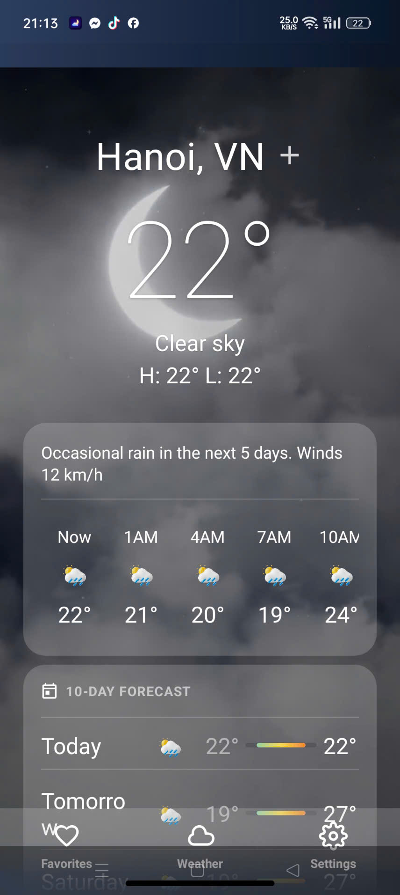
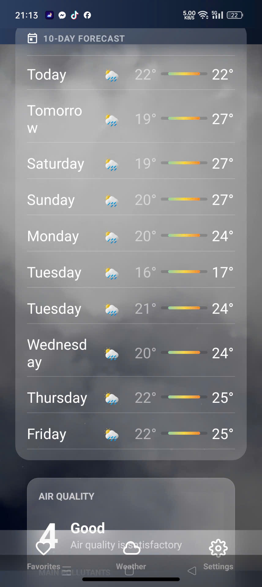
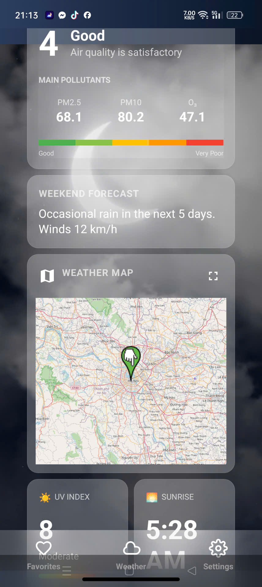
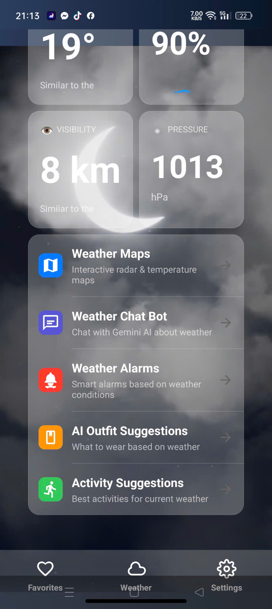
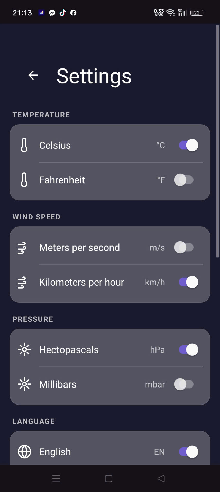

# Weather App 🌤️

> Modern Android weather app with Material Design 3, Real-time data & AI-powered features

Ứng dụng thời tiết Android hiện đại với **Material Design 3**, **MVVM Architecture**, **Interactive Weather Maps**, **Offline Mode** và **AI Chat Assistant**.

## 📱 Screenshots

| Giao Diện Chính 1 | Giao Diện Chính 2 | Giao Diện Chính 3 |
|---|---|---|
|  |  |  |

| Giao Diện Chính 4 | Cài Đặt |
|---|---|
|  |  |

## ✨ Tính Năng Chính

### 📍 Vị Trí & Tìm Kiếm
- 📍 Tự động phát hiện vị trí hiện tại
- 🔍 Tìm kiếm thành phố nhanh chóng
- 💾 Lưu nhiều thành phố yêu thích
- 🌍 Hỗ trợ tìm kiếm toàn cầu

### 🌡️ Dữ Liệu Thời Tiết Chi Tiết
- 🌡️ Nhiệt độ hiện tại & cảm giác
- 💨 Tốc độ gió & hướng gió
- 💧 Độ ẩm không khí
- 🌧️ Xác suất mưa & lượng mưa
- 📊 Áp suất khí quyển
- 👁️ Tầm nhìn xa
- ☀️ Chỉ số UV
- 🌅 Thời gian mặt trời mọc/lặn

### 📈 Dự Báo & Biểu Đồ
- 📊 Dự báo theo giờ (24h)
- 📅 Dự báo 7 ngày tới
- 📈 Biểu đồ nhiệt độ & độ ẩm
- 🔄 Cập nhật real-time

### 🗺️ Bản Đồ Thời Tiết Tương Tác
- 🗺️ Google Maps integration
- 🌡️ Temperature overlay
- 🌧️ Precipitation/Rain map
- ☁️ Cloud coverage
- 💨 Wind speed visualization
- 📊 Pressure patterns
- 🔀 Chuyển đổi layer dễ dàng
- 🎯 Zoom & Pan tự do

### 🤖 AI Chat Bot
- 💬 Chat với AI về thời tiết
- 🤔 Hỏi tư vấn thời tiết
- 💡 Gợi ý hoạt động hàng ngày
- 🧠 Powered by Gemini AI

### ⚠️ Cảnh Báo Thời Tiết
- 🔥 Cảnh báo nhiệt độ cao (>35°C)
- ❄️ Cảnh báo lạnh dưới 0°C
- ⚡ Cảnh báo giông/sét
- 🌧️ Cảnh báo mưa nặng
- 💧 Cảnh báo độ ẩm cao
- 🔔 Thông báo push tự động

### 🎨 Giao Diện & Thiết Kế
- 🎨 Material Design 3 modern
- 🌙 Dark mode & Light mode
- ✨ Glassmorphism effects
- 🎬 Smooth animations
- 📐 Responsive layout
- 🎯 User-friendly interface

### 📱 Tính Năng Hệ Thống
- 📶 Offline mode - hoạt động khi không có internet
- 💾 Cache dữ liệu với Room Database
- 🔄 Auto-refresh weather data
- ⚙️ Cài đặt tùy chỉnh đơn giản
- 🌡️ Chọn đơn vị nhiệt độ (°C / °F)
- 🗣️ Đa ngôn ngữ support

## 🛠️ Tech Stack

- **Language**: Java
- **Architecture**: MVVM + Clean Architecture
- **UI**: Material Design 3, XML Layouts
- **Database**: Room Database (Offline Cache)
- **API**: Retrofit + OkHttp
- **Maps**: Google Maps SDK, OSMDroid
- **Charts**: MPAndroidChart
- **Background**: WorkManager (Notifications)
- **AI**: Gemini 2.5 Flash API
- **Location**: Google Play Services Location
- **Image Loading**: Glide
- **Animations**: Lottie

## 📋 Requirements

- Android 7.0+ (API 24)
- Google Play Services
- Android Studio Hedgehog+

## 🚀 Installation

1. **Clone repository**
   ```bash
   git clone https://github.com/nichikei/weather-app.git
   cd weather-app
   ```

2. **Setup API Keys** - Tạo file `local.properties`:
   ```properties
   weather.api.key=YOUR_OPENWEATHER_API_KEY
   gemini.api.key=YOUR_GEMINI_API_KEY
   sdk.dir=/path/to/android/sdk
   ```

3. **Build & Run**
   ```bash
   ./gradlew build
   # Chạy trên emulator hoặc device
   ```

## 📝 Project Structure

```
app/src/main/
├── java/com/example/weatherapp/
│   ├── presentation/     # UI Layer (Activity, ViewModel)
│   ├── domain/          # Business Logic (UseCase, Repository)
│   ├── data/            # Data Layer (API, Database)
│   └── util/            # Utilities & Helpers
└── res/
    ├── layout/          # XML Layouts
    ├── drawable/        # Vector graphics & animations
    └── values/          # Colors, strings, themes
```

## 🔑 API Keys

- **OpenWeather**: https://openweathermap.org/api
- **Google Maps**: https://cloud.google.com/maps-platform
- **Gemini AI**: https://ai.google.dev

⚠️ **Never commit API keys!** Use `local.properties` (added to `.gitignore`)

## 📄 License

MIT License - Feel free to use this project

## 👤 Author

- **GitHub**: [@nichikei](https://github.com/nichikei)

---

**Made with ❤️ using Android & Material Design 3**

